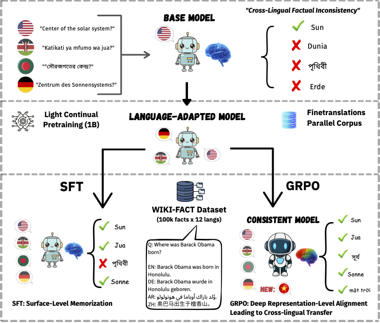

# Lost in Multilinguality: Unlocking Latent Multilingual Knowledge via Consistency-Driven Reinforcement Learning

> **Louis Arts, George Burgess, Eleftheria Kolokytha, Harry O'Donnell, Ektor Oikonomidis Doumpas, Jonathan von Rad**  
> University College London

---

*Figure 1: Two-stage pipeline for inducing cross-lingual consistency in English-pretrained LLMs. Light CPT on parallel data enables multilingual capability, while GRPO-based reinforcement learning reshapes internal representations to produce consistent factual predictions across languages, unlike SFT which results in surface-level memorization.*

---

## Overview

Large language models trained predominantly on English data encode substantial world knowledge but often fail to express it in other languages — a phenomenon we call **cross-lingual factual inconsistency**. This repository contains the code and dataset for our two-stage pipeline to unlock latent multilingual knowledge:

1. **Light Continual Pretraining (CPT)** on 1B tokens of parallel data to enable multilingual capability
2. **Consistency-Driven Reinforcement Learning (GRPO)** to reshape internal representations and produce consistent factual predictions across languages

Applied to OLMo-2-7B, our approach extends coverage to the **12 most widely spoken languages** (18.5% → 70% of the global population) and consistently outperforms supervised fine-tuning (SFT).

---

## Key Results

| Model | WIKI-FACT (High) | WIKI-FACT (Low) | KLAR (Seen) | KLAR (OOD) | Global-MMLU (High) | Global-MMLU (Low) |
|---|---|---|---|---|---|---|
| Baseline | 57.93 | 51.80 | 24.6 | 13.3 | 38.72 | 31.79 |
| Aligned | 57.89 | 51.82 | 17.0 | 8.3 | 37.41 | 29.32 |
| SFT | 56.33 | 50.04 | 18.1 | 7.8 | 35.40 | 30.32 |
| Aligned + SFT | 59.20 | 52.02 | 20.7 | 8.6 | 36.15 | 30.88 |
| **GRPO** | **60.71** | **54.41** | **29.0** | **16.7** | **39.22** | **32.00** |
| Aligned + GRPO | 61.26 | 54.48 | 29.8 | 17.6 | 36.34 | 29.61 |

GRPO consistently outperforms SFT across all benchmarks and generalises to **11 unseen (out-of-distribution) languages** not present in training — indicating it promotes genuinely language-agnostic representations rather than surface-level memorization.

---

## Languages

| Code | Language | Family | Native Speakers (M) |
|---|---|---|---|
| en | English | Indo-European | 1,500 |
| zh | Chinese | Sino-Tibetan | 1,400 |
| es | Spanish | Indo-European | 595 |
| ar | Arabic | Afro-Asiatic | 400 |
| fr | French | Indo-European | 300 |
| bn | Bengali | Indo-European | 300 |
| pt | Portuguese | Indo-European | 270 |
| ru | Russian | Indo-European | 260 |
| id | Indonesian | Austronesian | 200 |
| de | German | Indo-European | 135 |
| ja | Japanese | Japonic | 130 |
| sw | Swahili | Niger-Congo | 100 |

---

## Dataset: WIKI-FACT

We open-source **WIKI-FACT**, a parallel multilingual multiple-choice QA dataset grounded in Wikidata.

- 🌍 **100,000 facts** × 12 languages
- 22 factual relation types spanning geography, biography, creative works, and organizational/cultural ties
- Splits: 95,000 train / 2,500 validation / 2,500 test
- Every fact is **fully parallel** across all 12 languages
