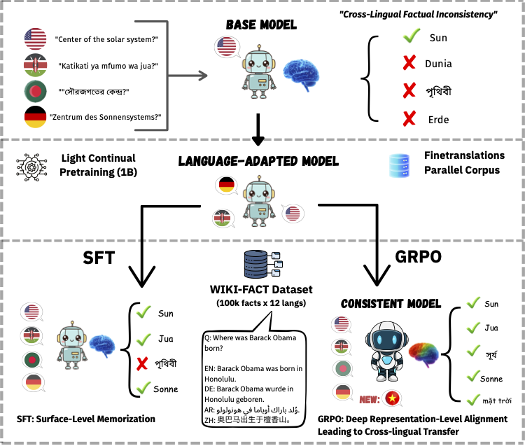

# Improving Multilingual Knowledge Access via Consistency-Driven Reinforcement Learning


<p align="center">
  
</p>

## Overview

LLMs trained on English data encode vast world knowledge but often fail to express it in other languages — **cross-lingual factual inconsistency**. We propose a two-stage pipeline to fix this without large-scale retraining:

1. **Light Continual Pretraining (CPT)** on 1B tokens of parallel data
2. **Consistency-Driven RL (GRPO)** to reshape internal representations for consistent cross-lingual factual recall

Applied to OLMo-2-7B across the 12 most widely spoken languages (18.5% → 70% of the global population). Code and dataset open-sourced.

## Results

| Model | WIKI-FACT (High/Low) | KLAR (Seen/OOD) | Global-MMLU (High/Low) |
|---|---|---|---|
| Baseline | 57.93 / 51.80 | 24.6 / 13.3 | 38.72 / 31.79 |
| SFT | 56.33 / 50.04 | 18.1 / 7.8 | 35.40 / 30.32 |
| **GRPO** | **60.71 / 54.41** | **29.0 / 16.7** | **39.22 / 32.00** |
| Aligned + GRPO | 61.26 / 54.48 | 29.8 / 17.6 | 36.34 / 29.61 |

GRPO outperforms SFT across all benchmarks and transfers to **11 unseen languages** not seen during training.

## Dataset: PolyFact

🤗 (open-sourced upon publication) — 100K facts × 12 languages, fully parallel, grounded in Wikidata. Split: 95K train / 2.5K val / 2.5K test.

## Installation

```bash
git clone https://github.com/jvonrad/Lost-in-Mistranslation
cd Lost-in-Mistranslation
pip install -r requirements.txt
```

## Evaluation

**Per-language accuracy** on PolyFact (logprob scoring over the 4 MCQ options):

```bash
python evaluate/evaluate_accuracy.py \
  --hf_dataset jvonrad/WIKI-FACT --split test \
  --model allenai/OLMo-2-1124-7B --batch_size 8 --score_mode avg
```

**Cross-lingual consistency** — Total Consistency (fraction of facts answered
correctly in *all* 12 languages) and RankC (Qi et al., EMNLP 2023) per language
pair, plus pairwise answer agreement:

```bash
# PolyFact
python evaluate/evaluate_crosslingual_consistency.py \
  --benchmark polyfact --hf_dataset jvonrad/WIKI-FACT --split test \
  --model allenai/OLMo-2-1124-7B --batch_size 8 \
  --alignment_cache evaluate/alignments/polyfact_test_alignment.json \
  --output_json results/olmo2_base_polyfact_consistency.json

# Global-MMLU (12 paper languages, options parallel by index)
python evaluate/evaluate_crosslingual_consistency.py \
  --benchmark global_mmlu --split test \
  --model allenai/OLMo-2-1124-7B --batch_size 8 \
  --output_json results/olmo2_base_gmmlu_consistency.json
```

PolyFact options are independently shuffled per language without stored
distractor entity ids, so RankC requires aligning each language's options to
the English ones. `evaluate/alignments/polyfact_test_alignment.json` ships a
precomputed alignment for the test split (gold via `answer_text`, distractors
via normalized string match, remainder via LaBSE embeddings + optimal
assignment; 0 of 27,753 language entries unaligned). Pass it as
`--alignment_cache` to reproduce our numbers exactly; delete it to recompute.

The consistency evaluator runs on CUDA, CPU, or AWS Trainium (`--device xla`
with `torch-neuronx`; batches are padded to fixed shapes to avoid
recompilation).

### Running on AWS Trainium (trn1/trn2)

`bash setup_trainium.sh` bootstraps a bare Ubuntu instance end to end: Neuron
apt repo + driver (including a source patch needed on kernel ≥ 7.0), runtime
and tools, missing system libraries on Ubuntu 26.04, and a Python 3.11 venv
at `~/neuron_venv` with `torch-neuronx`. It is idempotent and finishes with a
device sanity check. Then:

```bash
source ~/neuron_venv/bin/activate   # also sets PJRT_DEVICE=NEURON
python evaluate/evaluate_crosslingual_consistency.py --device xla ...
```

If a Neuron compilation ever fails due to a missing library, fix it and then
delete `/var/tmp/neuron-compile-cache` — Neuron caches failed compilations
and will replay the old error otherwise.

Global-MMLU results use eval on Global-MMLU-Lite 

Model List:
---
Olmo-2-1124-7B
---
Base: allenai/OLMo-2-1124-7B
CPT: jvonrad/OLMo-2-1124-7B-TED
SFT: jvonrad/olmo-2-7b-wikifact-sft
CPT + SFT: jvonrad/olmo-2-7b-aligned-wikifact-sft
GRPO: jvonrad/olmo-2-7b-grpo-att-mlp-full
CPT + GRPO: jvonrad/olmo-2-7b-finetranslation-wikifact-grpo-att-mlp-checkpoint
---
Qwen2.5-7B
---
Base: Qwen/Qwen2.5-7B
CPT: jvonrad/Qwen-2.5-7B-TED
SFT: jvonrad/Qwen-2.5-7B-SFT-CE-random
CPT + SFT: jvonrad/Qwen-2.5-7B-TED-SFT
GRPO: jvonrad/Qwen-2.5-7B-grpo-consistent
CPT + GRPO: jvonrad/Qwen-2.5-7B-TED-grpo


